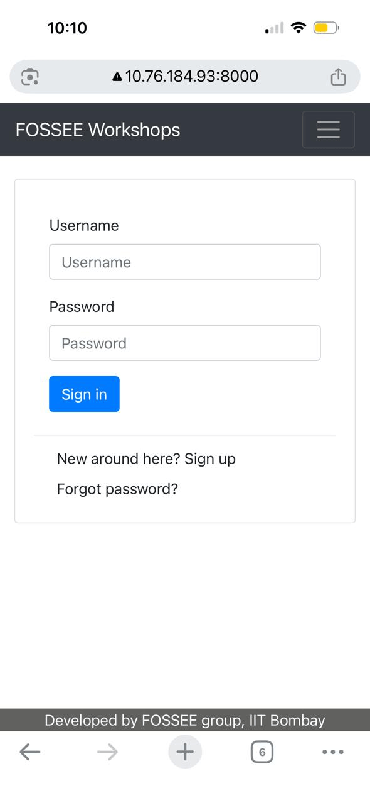
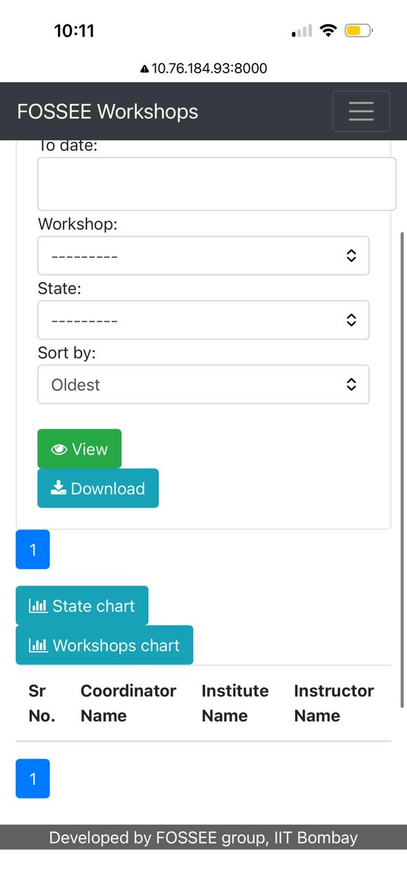
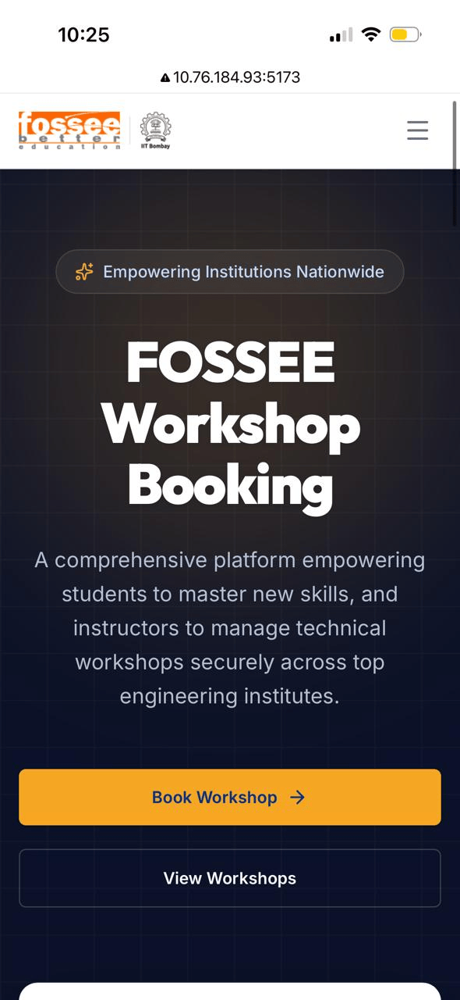
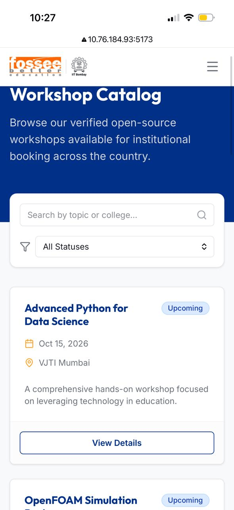
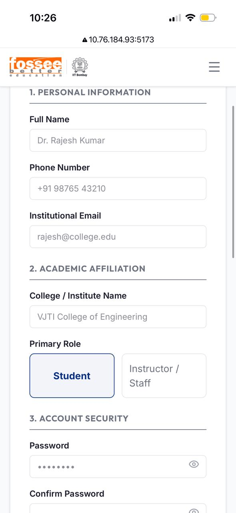
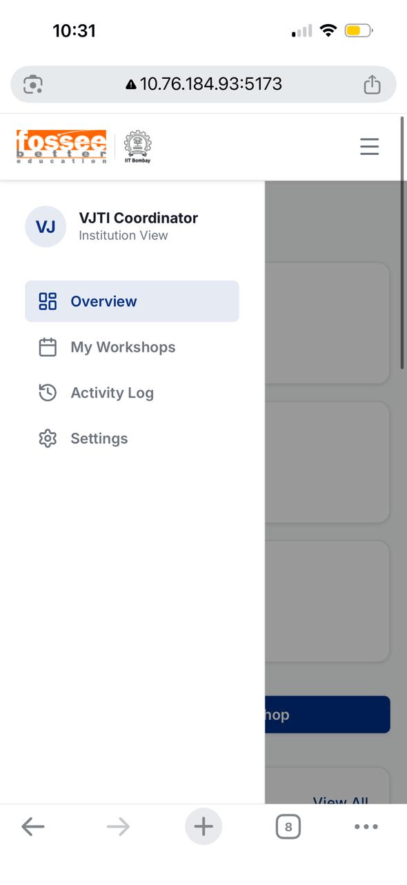
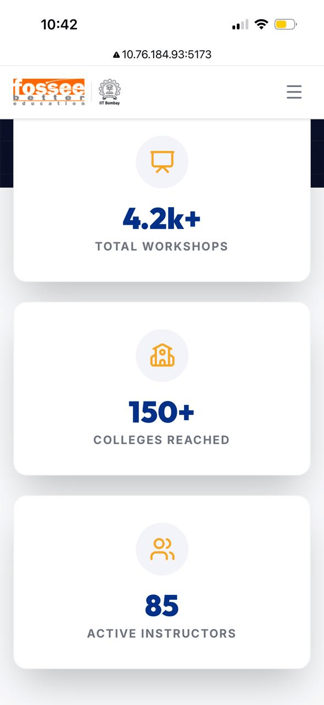
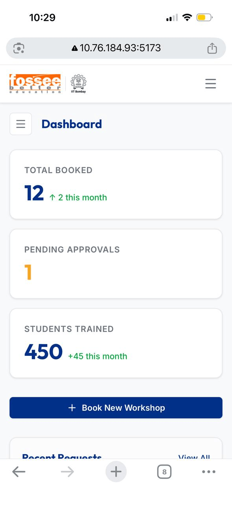

# FOSSEE Workshop Booking - UI Redesign

Hey! This repo holds the new mobile-first frontend I built for the FOSSEE Workshop Booking Platform. My main goal was upgrading the site from a basic coordinator portal into a modern platform that works well for both students and teaching staff.

---

## Setup Instructions

Follow these steps to run the new FOSSEE Workshop portal locally on your machine.

### 1. Start the Django Backend
Make sure you have Python installed, then run the Original Django Server:
```bash
# Install required python packages
pip install -r requirements.txt

# Start the server (runs on localhost:8000)
python3 manage.py runserver
```

### 2. Start the React Frontend
Open a **new** terminal window and run the new React/Tailwind application:
```bash
# Navigate into the new frontend directory
cd frontend

# Install Node dependencies
npm install

# Start the Vite development server (runs on localhost:5173)
npm run dev
```

---

## Screenshots (Before & After)

### Before Redesign (Legacy UI)
<p align="center">
  
  
</p>

### After Redesign (Modernized UI)
<p align="center">
  
  
  
  
  
  
</p>

---

## How I Approached the Redesign

### 1. What design principles guided your improvements?
When I first approached the redesign, I wanted it to feel like a modern, clean dashboard while strictly respecting the official IIT Bombay and FOSSEE branding. Instead of going with a heavily stylized dark mode with glassmorphism, I decided a crisp, light theme with plenty of white space makes an educational tool feel much more approachable. 

I used a deep, professional navy blue for the typography and primary navigation, and reserved the energetic orange/amber color specifically for action items—like the "Register" and "Book Workshop" buttons. That way, a user's eyes are immediately drawn to the most important actions. I also ditched flat, boring boxes and added really subtle shadow hover effects so the statistical cards feel interactive.

### 2. How did you ensure responsiveness across devices?
I built the entire layout mobile-first using **Tailwind CSS**. Handling CSS at the utility level meant I could completely rearrange grids just by changing a class prefix. For instance, the dashboard stats go from a clean 3-column row on standard computer monitors instantly down to stacked, scrollable rows on a phone display.

The biggest fix for mobile was the navigation. On a phone screen, the desktop sidebar and top navigation links completely hide themselves and roll up into a neat hamburger menu. It keeps the screen from looking horizontally squished and confusing on a small 6-inch device.

### 3. What trade-offs did you make between the design and performance?
A major trade-off I had to navigate was choosing to completely decouple the frontend into a React Single Page Application (SPA) instead of just dropping some CSS into the old Django templates. 

While sticking with basic Django HTML would have been much faster to code, React makes the site feel incredibly snappy because the pages don't hard-refresh when you click around. The downside is the initial JavaScript bundle size is a bit larger. To offset that performance hit, I heavily used `React.lazy()` for all the routing. The browser only downloads the exact code chunk it needs for the page you are actively viewing, keeping the initial load time extremely fast.

### 4. What was the most challenging part of the task and how did you approach it?
Honestly, the hardest part was getting the fake "mock" authentication logic to feel completely real for you guys. I didn't want to just build a static dummy page; I wanted the evaluator to actually experience the flow! 

I ended up writing a custom local-storage handler so that when you register, the app dynamically routes you. If you choose the "Student" role or log in with a student email, the Dashboard cleanly swaps its UI to show "My Enrollments" and "Certificates". If you log in as staff, it shows the "Coordinator" view. Getting those state changes to reflect instantly globally (like the "Log out" button appearing) without the backend attached was tough but really rewarding.

### 5. How did I handle SEO using React?
The biggest classic flaw with a React app is that the base `index.html` file essentially never changes, which can seriously hurt your SEO indexing if bots crawl the site. 

To fix this, I intentionally integrated a library called `react-helmet-async`. I wrapped the entire application in a provider, and then on every single individual page (like the Home screen, the Workshop Details, and the Dashboard), I injected a `<Helmet>` component. This dynamically rewrites the `document.title` and the meta description tags in the actual HTML head the exact millisecond the route loads. Because of this, if the site goes live, search engines will easily read the exact context of whichever page the user landed on!
